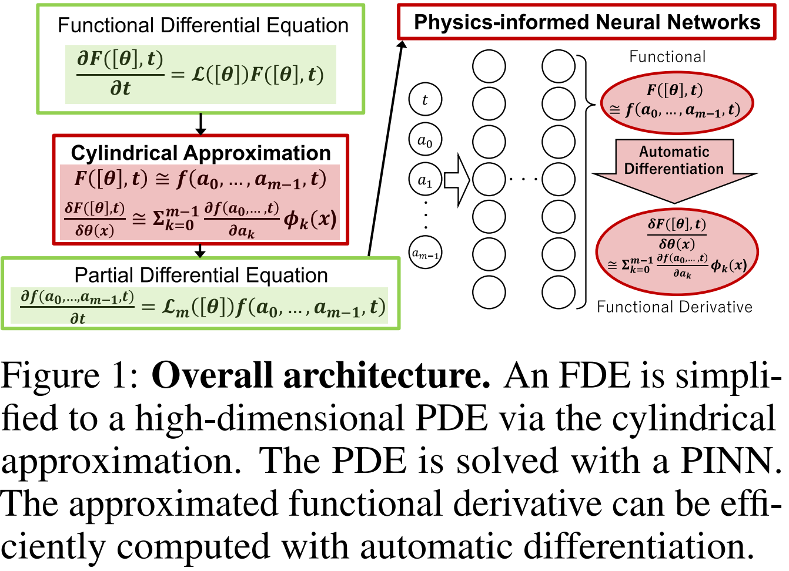
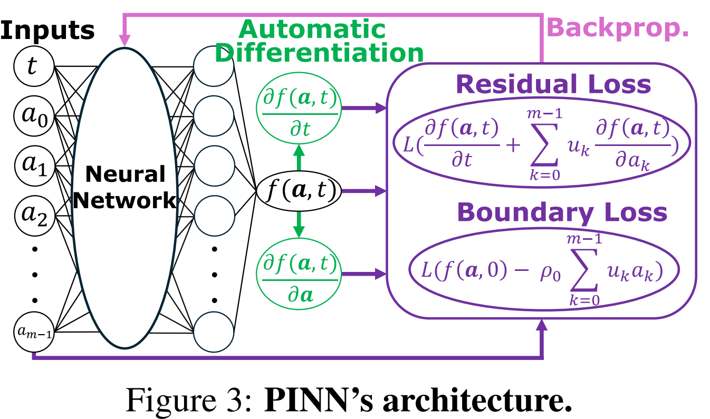

# Functional PINN <!-- omit in toc -->
<!-- https://qiita.com/eyuta/items/b1a53f3da8c5f8e7f41d  https://github.com/paperswithcode/releasing-research-code   -->

<p style="font-size: 25px;">
    <span style="color:red">
        🌟Work in progress! Please use ./full_code for now.🌟
    </span>
</p>

This is the official implementation of physics-informed neural networks (PINNs) for functional differential equations (Functional PINN) proposed in

<p style="font-size: 20px;">
    "Physics-informed Neural Networks for Functional Differential Equations: Cylindrical Approximation and Its Convergence Guarantees" (NeurIPS 2024).
</p>

- Full paper: please see [`./fullpaper.pdf`](./full_paper.pdf)
- Full paper at OpenReview: TBA
- arXiv preprint: https://arxiv.org/abs/2410.18153
- bibtex: please see Citation at the bottom of this page.

# Table of Contents <!-- omit in toc -->

- [1. Introduction: Overall architecture](#1-introduction-overall-architecture)
- [2. Requirements](#2-requirements)
- [3. Training](#3-training)
- [4. Files and Directories](#4-files-and-directories)
- [5. Citation](#5-citation)
- [Todo](#todo)

# 1. Introduction: Overall architecture

The overall architecture and structure of the PINN are shown in the following images.
We first approximate functional differential equations (FDEs) using the cylindrical approximation, leading to high-dimensional PDEs.
We implement these PDEs.



# 2. Requirements

Please see [`requirements.txt`](./requirements.txt) and run `$ pip install -r requirements.txt` to install exactly the same libraries used in our environment. Specifically, we used:

- Python 3.11
- PyTorch 2.2.0
- Numpy 1.26.0

# 3. Training

TODO
`$ python train.py`

# 4. Files and Directories

- [`./configs`](./configs)
- [`./dataprocesses`](./dataprocesses)
- [`./losses`](./losses)
- [`./models`](./models)
- [`./optimizers`](./optimizers)
- [`./utils`](./utils)
- [`./train.py`](./train.py)
- [`./training_controller.py`](./training_controller.py)
- [`./full_code`](./full_code)
  - All codes submitted to NeurIPS 2024. Just for reference. If you miss something in the top directory, you could find it here, or contact us.
- [`full_paper.pdf`](./full_paper.pdf)
  - The full paper of our work. This is exactly the same as the one submitted to OpenReview but is different from the arXiv paper.

# 5. Citation

```
TBA (Will be open in November or December 2024)
```


# Todo
- train.py
  - Delete multigpu
  - Delete Optuna
  - Remove exp_phase = "tuning" and "stat"